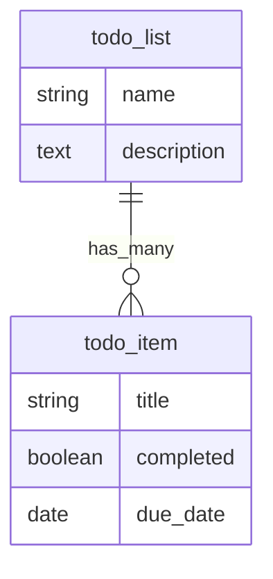

# Developer Tools

LCP Ruby includes rake tasks for validating YAML configuration, visualizing model relationships, auditing permissions, and managing users.

## `lcp_ruby:validate`

Validates all YAML configuration files (models, presenters, permissions) and reports errors.

### Usage

```bash
bundle exec rake lcp_ruby:validate
```

### What It Checks

The task runs two validation passes:

**1. Configuration validation** (`ConfigurationValidator`):
- YAML syntax errors
- Required attributes (model name, field types, etc.)
- Valid field types (must be one of the 14 supported types)
- Valid association types (`belongs_to`, `has_many`, `has_one`)
- Valid validation types (must be one of the 8 supported types)
- Cross-references (presenter `model` must reference an existing model, etc.)
- Duplicate field names within a model

**2. Service reference validation** (`Services::Checker`):
- Registered built-in types, transforms, and defaults
- Auto-discovered data providers from `app/lcp_services/data_providers/`
- Verifies all service references in model definitions resolve to registered services

### Example Output

```
Validating configuration at: /path/to/app/config/lcp_ruby

Models:      3
Presenters:  4
Permissions: 2
```

On error:

```
Validating configuration at: /path/to/app/config/lcp_ruby

[FATAL] Failed to load metadata: Field type 'text_area' is invalid for field 'description'
```

The task exits with status code 1 on failure, making it suitable for CI pipelines.

## `lcp_ruby:erd`

Generates an Entity Relationship Diagram from your model definitions.

### Usage

```bash
# Output to console (Mermaid format, default)
bundle exec rake lcp_ruby:erd

# Specify format
FORMAT=mermaid bundle exec rake lcp_ruby:erd
FORMAT=dot bundle exec rake lcp_ruby:erd
FORMAT=plantuml bundle exec rake lcp_ruby:erd

# Save to file
OUTPUT=docs/erd.md FORMAT=mermaid bundle exec rake lcp_ruby:erd
OUTPUT=erd.dot FORMAT=dot bundle exec rake lcp_ruby:erd
OUTPUT=erd.puml FORMAT=plantuml bundle exec rake lcp_ruby:erd
```

### Supported Formats

| Format | Description | Rendering |
|--------|-------------|-----------|
| `mermaid` | Mermaid.js diagram syntax (default) | Rendered natively in GitHub Markdown |
| `dot` | Graphviz DOT format | `dot -Tpng erd.dot -o erd.png` |
| `plantuml` | PlantUML format | `plantuml erd.puml` |

### Example Output (Mermaid)



### Integration with CI

Add validation to your CI pipeline to catch configuration errors early:

```yaml
# .github/workflows/test.yml
- name: Validate LCP Ruby configuration
  run: bundle exec rake lcp_ruby:validate
```

## `lcp_ruby:permissions`

Prints a permission matrix showing which roles have what access across all models.

### Usage

```bash
bundle exec rake lcp_ruby:permissions
```

### Example Output

```
Permission Matrix
=================

Model: deal
  Role        | CRUD                              | Fields (R/W) | Actions       | Scope       | Presenters
  ------------|-----------------------------------|--------------|---------------|-------------|------------------
  admin       | index show create update destroy   | all / all    | all           | all         | all
  sales_rep   | index show create update           | all / 4      | close_won     | all         | deal
  viewer      | index show                         | 3 / 0        | none          | all         | deal_pipeline
```

The matrix displays one table per model with permission files. For each role it shows:
- **CRUD** — allowed operations
- **Fields (R/W)** — readable/writable field counts (or "all")
- **Actions** — allowed custom actions (or "all"/"none")
- **Scope** — scope type or "all"
- **Presenters** — accessible presenters (or "all")

This is useful for auditing permissions and verifying that roles have the expected access levels.

## `lcp_ruby:create_admin`

Creates or updates an admin user for LCP Ruby's built-in authentication system.

> **Note:** This task only works when `config.authentication = :built_in` is set in your initializer. It will abort with an error message otherwise.

### Usage

```bash
# Minimal (required parameters only)
bundle exec rake lcp_ruby:create_admin EMAIL=admin@example.com PASSWORD=secret123

# Full (all parameters)
bundle exec rake lcp_ruby:create_admin EMAIL=admin@example.com PASSWORD=secret123 NAME="Jane Admin" ROLES=admin,manager
```

### Parameters

| Parameter | Required | Default | Description |
|-----------|----------|---------|-------------|
| `EMAIL` | Yes | — | Email address for the admin user |
| `PASSWORD` | Yes | — | Password for the admin user |
| `NAME` | No | `"Admin"` | Display name |
| `ROLES` | No | `"admin"` | Comma-separated list of roles |

### Behavior

- If a user with the given email already exists, the task **updates** their attributes (name, password, roles, active status).
- If no user exists with that email, the task **creates** a new one.
- The user is always set to `active: true`.
- On success, prints whether the user was created or updated.
- On failure (validation errors), prints the error messages and exits with status code 1.

### Example Output

```
Created admin user: admin@example.com (roles: admin)
```

Or when updating an existing user:

```
Updated admin user: admin@example.com (roles: admin, manager)
```

## Summary

| Task | Purpose | Source |
|------|---------|--------|
| `lcp_ruby:validate` | Validate YAML configuration | `lib/tasks/lcp_ruby.rake` |
| `lcp_ruby:erd` | Generate ERD diagrams | `lib/tasks/lcp_ruby.rake` |
| `lcp_ruby:permissions` | Display permission matrix | `lib/tasks/lcp_ruby.rake` |
| `lcp_ruby:create_admin` | Create/update admin user | `lib/tasks/lcp_ruby_auth.rake` |
