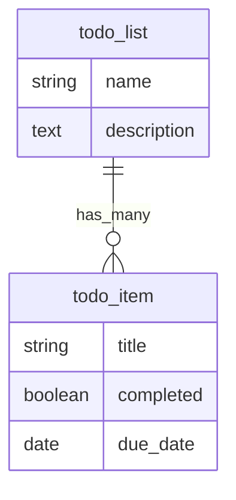

# Developer Tools

LCP Ruby includes two rake tasks for validating your YAML configuration and visualizing model relationships.

## `lcp_ruby:validate`

Validates all YAML configuration files (models, presenters, permissions) and reports errors.

### Usage

```bash
bundle exec rake lcp_ruby:validate
```

### What It Checks

The validator loads all YAML files through the metadata parser and runs `ConfigurationValidator`, which checks:

- YAML syntax errors
- Required attributes (model name, field types, etc.)
- Valid field types (must be one of the 14 supported types)
- Valid association types (`belongs_to`, `has_many`, `has_one`)
- Valid validation types (must be one of the 8 supported types)
- Cross-references (presenter `model` must reference an existing model, etc.)
- Duplicate field names within a model

### Example Output

```
Validating configuration at: /path/to/app/config/lcp_ruby

Models:      3
Presenters:  4
Permissions: 2
```

On error:

```
Validating configuration at: /path/to/app/config/lcp_ruby

[FATAL] Failed to load metadata: Field type 'text_area' is invalid for field 'description'
```

The task exits with status code 1 on failure, making it suitable for CI pipelines.

## `lcp_ruby:erd`

Generates an Entity Relationship Diagram from your model definitions.

### Usage

```bash
# Output to console (Mermaid format, default)
bundle exec rake lcp_ruby:erd

# Specify format
FORMAT=mermaid bundle exec rake lcp_ruby:erd
FORMAT=dot bundle exec rake lcp_ruby:erd
FORMAT=plantuml bundle exec rake lcp_ruby:erd

# Save to file
OUTPUT=docs/erd.md FORMAT=mermaid bundle exec rake lcp_ruby:erd
OUTPUT=erd.dot FORMAT=dot bundle exec rake lcp_ruby:erd
OUTPUT=erd.puml FORMAT=plantuml bundle exec rake lcp_ruby:erd
```

### Supported Formats

| Format | Description | Rendering |
|--------|-------------|-----------|
| `mermaid` | Mermaid.js diagram syntax (default) | Rendered natively in GitHub Markdown |
| `dot` | Graphviz DOT format | `dot -Tpng erd.dot -o erd.png` |
| `plantuml` | PlantUML format | `plantuml erd.puml` |

### Example Output (Mermaid)



### Integration with CI

Add validation to your CI pipeline to catch configuration errors early:

```yaml
# .github/workflows/test.yml
- name: Validate LCP Ruby configuration
  run: bundle exec rake lcp_ruby:validate
```

## `lcp_ruby:permissions`

Prints a permission matrix showing which roles have what access across all models.

### Usage

```bash
bundle exec rake lcp_ruby:permissions
```

### Example Output

```
Permission Matrix
=================

Model: deal
  Role        | CRUD                              | Fields (R/W) | Actions       | Scope       | Presenters
  ------------|-----------------------------------|--------------|---------------|-------------|------------------
  admin       | index show create update destroy   | all / all    | all           | all         | all
  sales_rep   | index show create update           | all / 4      | close_won     | all         | deal_admin
  viewer      | index show                         | 3 / 0        | none          | all         | deal_pipeline
```

The matrix displays one table per model with permission files. For each role it shows:
- **CRUD** — allowed operations
- **Fields (R/W)** — readable/writable field counts (or "all")
- **Actions** — allowed custom actions (or "all"/"none")
- **Scope** — scope type or "all"
- **Presenters** — accessible presenters (or "all")

This is useful for auditing permissions and verifying that roles have the expected access levels.

Source: `lib/tasks/lcp_ruby.rake`, `lib/lcp_ruby/metadata/configuration_validator.rb`, `lib/lcp_ruby/metadata/erd_generator.rb`
